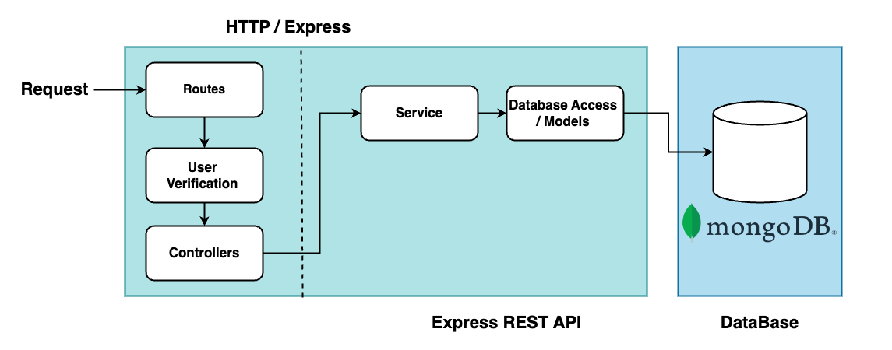

# To-Do app
You are challenged to do a simple To-Do app, using Node.JS (using Typescript
would be a bonus), where a user logs in, can post a note, can get/view his notes,
and can delete them, etc. No frontend is required (that would be a bonus too). The
idea is to use this app using Postman.

# Project Structure and Stack

## Overview

This application is built using Node.js with Express to create RESTful APIs. MongoDB is used as the primary database to store application data. For user management and authentication, Passport.js is utilized in conjunction with JWT tokens to secure API access.

## Project Divisions

The project is divided into two main parts:

1. **User Management**
2. **Task Management**

---

## User Management

The User Management module handles all operations related to users, including authentication, profile management, and account status.

- **Login**: 
  - Endpoint for user authentication using email and password.
  - Generates a JWT token upon successful authentication.

- **Register User**:
  - Endpoint for creating a new user account.
  - Stores user details in MongoDB.

- **Change Password**:
  - Allows users to update their password.
  - Requires old password verification.
  - Protected by JWT token authentication.

- **Get User Details**:
  - Fetches detailed information about the logged-in user.
  - Protected by JWT token authentication.

- **User Deactivate (Soft Delete)**:
  - Allows users to deactivate their account temporarily.
  - Marks the user account as inactive without deleting data.

- **Delete Account**:
  - Permanently deletes the user account.
  - Removes all associated tasks from the database.

---

## Task Management

The Task Management module covers all operations related to task creation, updates, status changes, and retrieval.

- **Create Task**:
  - Endpoint to create a new task.
  - Associates the task with the authenticated user.

- **Update Task**:
  - Allows users to update task details.
  - Requires task ID and updated data.

- **Filter Tasks**:
  - Provides filtering options based on date, status, and pagination limits.
  - Returns a list of tasks matching the criteria.

- **Get Individual Task Details**:
  - Fetches detailed information about a specific task.
  - Requires task ID.

- **Change Task Status**:
  - Allows changing the status of a task.
  - Status options include Pending, In-Process, and Complete.

- **Delete Task**:
  - Deletes a specified task from the database.
  - Requires task ID.

---

## Technology Stack

- **Backend Framework**: Node.js with Express (Typescript)
- **Database**: MongoDB
- **Authentication**: Passport.js with JWT tokens
- **Data Format**: JSON
- **Testing** : Mock

## Project Structure

```
└── 📁src
    └── app.ts
    └── 📁config
        └── appConfig.ts
        └── dbConfig.ts
    └── 📁controllers
        └── 📁task
            └── task.controller.ts
        └── 📁user
            └── auth.controller.ts
            └── user.controller.ts
    └── index.ts
    └── 📁interfaces
        └── 📁IAppConfig 
            └── index.ts
        └── 📁IDBConfig
            └── index.ts
        └── 📁ISessions
            └── index.ts
        └── 📁ITask
            └── index.ts
        └── 📁IToken
            └── index.ts
        └── 📁IUser
            └── index.ts
    └── 📁middlewares
        └── errorHandler.ts
        └── 📁validators
            └── task.validators.ts
            └── user.validators.ts
    └── 📁models
        └── index.ts
        └── 📁resetToken
            └── index.ts
        └── 📁sessions
            └── index.ts
        └── 📁task
            └── task.model.ts
        └── 📁user
            └── index.d.ts
            └── user.model.ts
    └── 📁passport
        └── index.ts
        └── passport.sessions.config.ts
    └── 📁routes
        └── index.ts
        └── 📁task
            └── index.ts
        └── 📁users
            └── auth.routes.ts
            └── error.routes.ts
            └── user.routes.ts
    └── 📁services
        └── auth.service.ts
        └── db.service.ts
        └── task.service.ts
        └── user.service.ts
    └── 📁tests
        └── 📁controllers
            └── authController.test.ts
            └── userController.test.ts
        └── 📁integration
            └── authIntegration.test.ts
            └── userIntegration.test.ts
        └── 📁services
            └── authService.test.ts
            └── userService.test.ts
    └── 📁utils
        └── constants.ts
        └── date.conveter.ts
        └── logger.ts
```

## Flow of Request 
Following diagram show the flow of API request on Background



## API Details 
This table provides a comprehensive overview of all available APIs, including request and response formats, parameters, and potential errors.

| **API Name**          | **Description**                                                                                                                                                                                                                                                                                                                                                                                                                                                                                                                                                                                                      | **Endpoint**                                  | **Request**                                                                                                                                                                                                                                                                                                                                                                                                                                                                                                                                                | **Response**                                                                                                                                                | **Error**                                                                                                          |
|-----------------------|--------------------------------------------------------------------------------------------------------------------------------------------------------------------------------------------------------------------------------------------------------------------------------------------------------------------------------------------------------------------------------------------------------------------------------------------------------------------------------------------------------------------------------------------------------------------------------------------------------------------------|-----------------------------------------------|--------------------------------------------------------------------------------------------------------------------------------------------------------------------------------------------------------------------------------------------------------------------------------------------------------------------------------------------------------------------------------------------------------------------------------------------------------------------------------------------------------------------------------------------------------------|------------------------------------------------------------------------------------------------------------------------------------------------------------|-------------------------------------------------------------------------------------------------------------------|
| `regularRegister`     | This API used by user to register   in the  `app` and used it wonderful feature | `http://localhost:3000/api/auth/regularRegister` | **Body (urlencoded)**<br> `username: test1`<br> `email: test1@gmail.com`<br> `password: password123`<br> `firstName: test1`<br> `lastName: user1`<br> `functionName: regularRegister`                                                                                                                                                                                                                                                                                                                                                                       | JSON response reflecting the submitted data.                                                                                                                | 200 OK or 201 Created                                                                                              |
| `createTask`          | This is a POST request, submitting data to an API via the request body. This request submits JSON data, and the data is reflected in the response. A successful POST request typically returns a 200 OK or 201 Created response code.                                                                                                                                                                                                                                                                                                                                                                                   | `http://localhost:3000/api/task/taskAPIRequest` | **Request Headers**<br> `Authorization: Bearer <token>`<br> **Body (urlencoded)**<br> `title: Job Task`<br> `description: Work on Task`<br> `dueDate: 2024-07-24`<br> `functionName: createTask`                                                                                                                                                                                                                                                                                                                                                             | JSON response reflecting the submitted data.                                                                                                                | 200 OK or 201 Created                                                                                              |
| `updateTask`          | This is a POST request, submitting data to an API via the request body. This request submits JSON data, and the data is reflected in the response. A successful POST request typically returns a 200 OK or 201 Created response code.                                                                                                                                                                                                                                                                                                                                                                                   | `http://localhost:3000/api/task/taskAPIRequest` | **Request Headers**<br> `Authorization: Bearer <token>`<br> **Body (urlencoded)**<br> `title: Job Task`<br> `description: Work on Task`<br> `dueDate: 2024-07-29`<br> `functionName: updateTask`<br> `status: pending`<br> `_id: 667b366cb9baa5cc166d6ba9`                                                                                                                                                                                                                                                                                                     | JSON response reflecting the submitted data.                                                                                                                | 200 OK or 201 Created                                                                                              |
| `filterTask`          | This is a POST request, submitting data to an API via the request body. This request submits JSON data, and the data is reflected in the response. A successful POST request typically returns a 200 OK or 201 Created response code.                                                                                                                                                                                                                                                                                                                                                                                   | `http://localhost:3000/api/task/taskAPIRequest` | **Request Headers**<br> `Authorization: Bearer <token>`<br> **Body (urlencoded)**<br> `pageNo: 1`<br> `pageLimit: 10`<br> `status: pending`<br> `functionName: filterTask`<br> `startDate: 2024-06-21`<br> `endDate: 2024-06-25`                                                                                                                                                                                                                                                                                                                               | JSON response reflecting the submitted data.                                                                                                                | 200 OK or 201 Created                                                                                              |
| `getTaskDetails`      | This is a POST request, submitting data to an API via the request body. This request submits JSON data, and the data is reflected in the response. A successful POST request typically returns a 200 OK or 201 Created response code.                                                                                                                                                                                                                                                                                                                                                                                   | `http://localhost:3000/api/task/taskAPIRequest` | **Request Headers**<br> `Authorization: Bearer <token>`<br> **Body (urlencoded)**<br> `_id: 667b33bed26b9578115b6977`<br> `functionName: getTaskDetails`                                                                                                                                                                                                                                                                                                                                                                                                   | JSON response reflecting the submitted data.                                                                                                                | 200 OK or 201 Created                                                                                              |
| `changeStatus`        | This is a POST request, submitting data to an API via the request body. This request submits JSON data, and the data is reflected in the response. A successful POST request typically returns a 200 OK or 201 Created response code.                                                                                                                                                                                                                                                                                                                                                                                   | `http://localhost:3000/api/task/taskAPIRequest` | **Request Headers**<br> `Authorization: Bearer <token>`<br> **Body (urlencoded)**<br> `_id: 667b366cb9baa5cc166d6ba9`<br> `functionName: changeStatus`<br> `status: in-progress`                                                                                                                                                                                                                                                                                                                                                                            | JSON response reflecting the submitted data.                                                                                                                | 200 OK or 201 Created                                                                                              |
| `deleteTask`          | This is a POST request, submitting data to an API via the request body. This request submits JSON data, and the data is reflected in the response. A successful POST request typically returns a 200 OK or 201 Created response code.                                                                                                                                                                                                                                                                                                                                                                                   | `http://localhost:3000/api/task/taskAPIRequest` | **Request Headers**<br> `Authorization: Bearer <token>`<br> **Body (urlencoded)**<br> `_id: 667b33bed26b9578115b6977`<br> `functionName: deleteTask`                                                                                                                                                                                                                                                                                                                                                                                                        | JSON response reflecting the submitted data.                                                                                                                | 200 OK or 201 Created                                                                                              |
| `updateUserDetails`   | This is a POST request, submitting data to an API via the request body. This request submits JSON data, and the data is reflected in the response. A successful POST request typically returns a 200 OK or 201 Created response code.                                                                                                                                                                                                                                                                                                                                                                                   | `http://localhost:3000/api/user/userAPIRequest` | **Request Headers**<br> `Authorization: Bearer <token>`<br> **Body (urlencoded)**<br> `firstName: test1`<br> `lastName: user1`<br> `functionName: updateUserDetails`<br> `email: test1@gmail.com`                                                                                                                                                                                                                                                                                                                                                            | JSON response reflecting the submitted data.                                                                                                                | 200 OK or 201 Created                                                                                              |
| `getUserDetails`      | This is a POST request, submitting data to an API via the request body. This request submits JSON data, and the data is reflected in the response. A successful POST request typically returns a 200 OK or 201 Created response code.                                                                                                                                                                                                                                                                                                                                                                                   | `http://localhost:3000/api/user/userAPIRequest` | **Request Headers**<br> `Authorization: Bearer <token>`<br> **Body (urlencoded)**<br> `functionName: getUserDetails`                                                                                                                                                                                                                                                                                                                                                                                                                                       | JSON response reflecting the submitted data.                                                                                                                | 200 OK or 201 Created                                                                                              |
| `statusChange`        | This is a POST request, submitting data to an API via the request body. This request submits JSON data, and the data is reflected in the response. A successful POST request typically returns a 200 OK or 201 Created response code.                                                                                                                                                                                                                                                                                                                                                                                   | `http://localhost:3000/api/user/userAPIRequest` | **Request Headers**<br> `Authorization: Bearer <token>`<br> **Body (urlencoded)**<br> `functionName: statusChange`<br> `isActivated: false`                                                                                                                                                                                                                                                                                                                                                                                                               | JSON response reflecting the submitted data.                                                                                                                | 200 OK or 201 Created                                                                                              |
| `deleteMyAccount`     | This is a POST request, submitting data to an API via the request body. This request submits JSON data, and the data is reflected in the response. A successful POST request typically returns a 200 OK or 201 Created response code.                                                                                                                                                                                                                                                                                                                                                                                   | `http://localhost:3000/api/user/userAPIRequest` | **Request Headers**<br> `Authorization: Bearer <token>`<br> **Body (urlencoded)**<br> `functionName: deleteMyAccount`                                                                                                                                                                                                                                                                                                                                                                                                                                     | JSON response reflecting the submitted data.                                                                                                                | 200 OK or 201 Created                                                                                              |
| `login`               | This is a POST request, submitting data to an API via the request body. This request submits JSON data, and the data is reflected in the response. A successful POST request typically returns a 200 OK or 201 Created response code.                                                                                                                                                                                                                                                                                                                                                                                   | `http://localhost:3000/api/auth/login`          | **Body (urlencoded)**<br> `username: test1`<br> `password: password123`                                                                                                                                                                                                                                                                                                                                                                                                                                             | JSON response reflecting the submitted data.                                                                                                                | 200 OK or 201 Created                                                                                              |

---